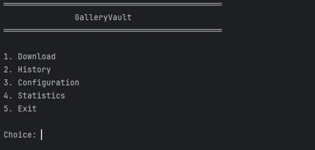
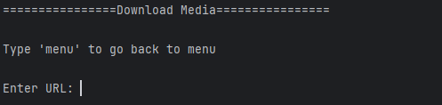
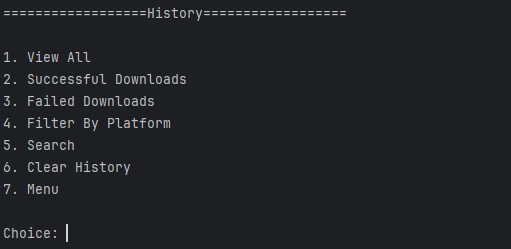
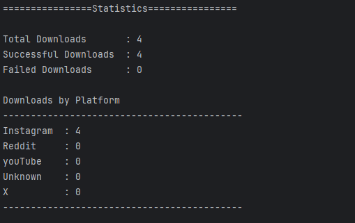

# GalleryVault

A Java-based console application that integrates with **gallery-dl** to download media from multiple platforms while maintaining download history, statistics, and configurable application settings.

GalleryVault was built as both a practical personal utility and a portfolio project to demonstrate clean Java architecture, object-oriented design, file handling, and modern Java programming practices.

---

## Project Status

**Current Version:** **v1.0.0**

GalleryVault is feature-complete as a console application.

The next major version will evolve the project into a **Spring Boot backend** with database support, REST APIs, and a more scalable architecture while reusing the existing business logic.

---

## Why GalleryVault?

GalleryVault was created to explore clean software architecture while solving a real-world problem. Beyond downloading media with **gallery-dl**, the project emphasizes maintainability, modular design, separation of responsibilities, and reusable components, making it a solid foundation for future backend development.

---

## Features

### 📥 Media Downloads

* Download media using **gallery-dl**
* Supports multiple platforms
* Handles successful and failed downloads
* Automatically records download history
* Tracks download duration
* Provides meaningful error messages

### 📜 Download History

* View complete download history
* View successful downloads
* View failed downloads
* Search downloads by keyword
* Filter downloads by platform
* Sort history (Newest First /Oldest First)
* Human-readable timestamps
* Display download duration
* Clear download history

### 📊 Statistics

* Total downloads
* Successful downloads
* Failed downloads
* Platform-wise download statistics

### ⚙️ Configuration

* Persistent configuration storage
* Easily configurable application settings

---

## Technologies Used

* Java 21
* Maven
* ProcessBuilder
* Java Collections Framework
* EnumMap
* Predicate (Functional Interfaces)
* Java Time API (`LocalDateTime`, `Duration`, `DateTimeFormatter`)
* Java NIO (`Files`, `Paths`)
* CSV File Storage
* Object-Oriented Programming (OOP)

---

## Project Structure

```text
src/main/java
│
├── app
│   └── Application entry point
│
├── config
│   └── Configuration management
│
├── download
│   ├── Download console
│   ├── Gallery downloader
│   └── Download utilities
│
├── history
│   ├── History manager
│   ├── History console
│   ├── Download record
│   └── History utilities
│
├── platform
│   └── Platform detection
│
└── statistics
    ├── Statistics manager
    ├── Statistics console
    └── Statistics utilities
```

---

## Project Architecture

GalleryVault follows a layered architecture where each layer has a single responsibility.

```text
Console Layer
       │
       ▼
Business Logic
       │
       ▼
Persistence (CSV Storage)
```

Example:

```text
DownloadConsole
        │
        ▼
GalleryDownloader
        │
        ▼
gallery-dl
```

```text
HistoryConsole
        │
        ▼
HistoryManager
        │
        ▼
DownloadRecord
```

This separation keeps the application modular, maintainable, and ready for future migration to Spring Boot.

---

## Design Principles

* Separation of Concerns
* Single Responsibility Principle (SRP)
* Constructor-based Dependency Injection
* Composition over Duplication
* Functional Programming using `Predicate`
* Enum-based Design
* Immutable Record Models
* Modular Package Structure
* Clean Layered Architecture

---

## Data Storage

GalleryVault stores its application data inside the user's home directory.

```text
~/.gallery-vault/
```

Application data currently includes:

* Download history (`CSV`)
* Configuration settings

The lightweight CSV-based approach keeps the application simple while allowing easy inspection and future migration to a relational database.

---

## Getting Started

### Prerequisites

* Java 21 or later
* Maven
* **gallery-dl** installed and available in your system `PATH`

### Clone the Repository

```bash
git clone https://github.com/tanzeel-codes/GalleryVault.git
cd GalleryVault
```

### Build

```bash
mvn clean package
```

### Run

```bash
mvn exec:java
```

Or execute the generated JAR file.

---

## Screenshots

* Main Menu

* Download

* History

* Statistics


---

## Roadmap

### ✅ Version 1.0

* Media downloads
* Download history
* Search
* Filtering
* Sorting
* Statistics
* Configuration
* Download duration tracking
* Human-readable timestamps
* Improved console interface

### 🚀 Version 2.0

* Spring Boot backend
* SQLite / MySQL support
* Spring Data JPA
* REST API
* Reuse existing business logic

### 🔮 Future

* Unit Tests
* Integration Tests
* GitHub Actions
* Docker support
* JavaFX GUI
* Logging
* Automatic history backup

---

## What I Learned

Building GalleryVault provided hands-on experience with:

* Clean Architecture
* Object-Oriented Design
* Java Collections Framework
* File Handling
* CSV Processing
* ProcessBuilder
* Functional Interfaces
* Java Time API
* Dependency Injection
* Clean Code Practices
* Git & GitHub Workflow
* Designing maintainable software

---

## Author

**Tanzeel Akhtar**

GitHub: https://github.com/tanzeel-codes

---

## License

This project is licensed under the **MIT License**.
